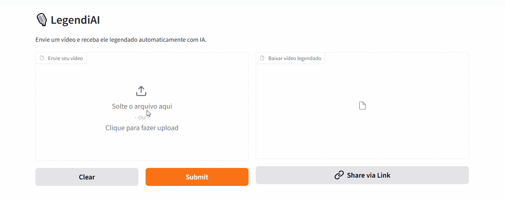

# 🚀 LegendiAI — Plataforma de Geração Automática de Legendas com IA

## 🌐 Live Demo

👉 **[Clique aqui para testar a aplicação](https://huggingface.co/spaces/DiggoMarino/legendiAI)** 

O **LegendiAI** é uma plataforma capaz de gerar legendas automaticamente para vídeos utilizando Inteligência Artificial, transformando áudio em texto sincronizado de forma rápida e acessível.

O projeto foi desenvolvido com foco em **acessibilidade**, **automação** e **experiência do usuário**, permitindo que qualquer pessoa envie um vídeo e receba um arquivo já legendado.

---

## 🎯 Principais funcionalidades

✅ Upload de vídeos diretamente pelo navegador
✅ Transcrição automática com IA
✅ Sincronização inteligente das legendas
✅ Divisão de frases baseada no tempo real da fala
✅ Renderização da legenda diretamente no vídeo
✅ Interface web acessível
✅ Deploy em ambiente cloud

---

## 🧠 Tecnologias utilizadas

* **Python**
* **OpenAI Whisper** (Speech-to-Text)
* **FFmpeg** (processamento de vídeo)
* **Gradio** (interface web)
* **HuggingFace Spaces** (deploy em nuvem)

---

## ⚙️ Arquitetura do projeto

O fluxo da aplicação segue a seguinte pipeline:

Upload do vídeo
→ Extração do áudio
→ Transcrição com Whisper
→ Geração do arquivo `.srt`
→ Sincronização das legendas
→ Renderização no vídeo com FFmpeg
→ Arquivo pronto para download

Essa abordagem garante uma legenda mais natural e alinhada ao tempo real da fala.

---

## 🧩 Desafios técnicos resolvidos

Durante o desenvolvimento, alguns problemas importantes foram tratados:

👉 Sincronização precisa entre fala e legenda
👉 Controle da velocidade de leitura para melhor experiência
👉 Processamento de arquivos de mídia em ambiente web
👉 Deploy de aplicação com IA
👉 Otimização da divisão de textos para evitar blocos longos

---

## 📚 Principais aprendizados

Este projeto permitiu aprofundar conhecimentos em:

* Construção de pipelines de IA
* Manipulação de áudio e vídeo
* Deploy de aplicações Python
* Estruturação de projetos reais
* Engenharia de experiência do usuário

---

## 🚀 Próximos passos

* Melhorar a velocidade de processamento
* Implementar suporte a múltiplos idiomas
* Criar sistema de autenticação
* Evoluir para um modelo SaaS
* Adicionar geração de legendas traduzidas

---

## 👨‍💻 Autor

Desenvolvido por **Diego Marino**

